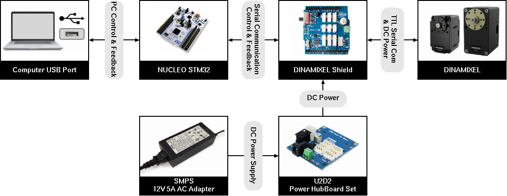

# ZG6 : commande du servo-moteur Dynamixel XL430-W250-T


Le moteur Dynamixel XL430-W250-T est un servo-moteur intégrant un 
contrôleur qui, côté externe, établit un protocole de communication de type
série pour échanger des informations avec le moteur, et côté interne implémente
un correcteur PID avec la possibilité d'utiliser des profils de fonctionnement.


* [Organisation matérielle](#hardware)
* [Description de la liaison TTL et de son protocole](#ttl)
* [Communication entre le microcontrôleur et le shield Dynamixel](#rs232)
* [Projet STM32F401/STM32F411](#software)
* [Configuration des ID des moteurs](#cfg)
* [Ressources](#rsrc)


<a id="hardware"></a>
## Organisation matérielle

On utilise pour le projet :

* une carte Nucleo avec un microcontrôleur STM32F411
* le shield arduino Dynamixel : [doc](https://emanual.robotis.com/docs/en/parts/interface/dynamixel_shield/)
* une carte d'alimentation U2D2



La connexion entre la carte STM32 et le Shield Arduino est détaillée ci-dessous.


L'interrupteur USARTSW doit être sur la position «Dynamixel» (celle représentée sur la figure).

La carte U2D2 fournit la puissance pour les moteurs et est connectée au shield Dynamixel par un connecteur TTL.

Le connecteur TTL fournit les signaux suivants

* G (Ground) : masse.
* V (12V) : alimentation fournie par la carte U2D2 pour l'alimentation des moteurs.
* D (TTL Data) : signal servant à la communication série avec les moteurs.

**Remarque sur la connexion des broches Tx et Rx de l'UASRT6 (PA11/PA12)** : ces broches doivent être connectées explicitement (avec des fils externes du bornier Morpho de la Nucleo au bornier arduino. Les deux bornes utilisées sur le bornier arduino ne sont en fait pas reliées au niveau de la carte Nucleo (voir les shunts SB62 et SB63 sur le schéma de la carte et sur la carte Nucleo elle-même). Il est donc possible de venir y connecter les broches Tx et Rx de l'USART6 (voir la partir [projet software](#software) pour plus de détail sur la configuration des broches).


<a id="ttl"></a>
## Description de la liaison TTL et de son protocole

La communication avec les servo-moteurs utilise une liaison série asynchrone half-duplex dérivée d'une liaison RS232 : la communication est possible dans les deux sens, mais, à un instant donné, un seul sens peut être utilisé.

L'intérêt de cette méthode est de ne nécessiter qu'un seul fil de donnée. Les moteurs peuvent être chaînés. Ils sont en fait connectés en parallèle sur le fil de données.


Chaque trame de communication est composée d'un paquet envoyé au moteur contenant une requête à réaliser, suivi d'un paquet de retour fourni par le moteur adressé et contenant un code de statut et la réponse à la requête envoyée.


Les moteurs doivent tous posséder un identifiant différent.

Les trames contenant les requêtes et le retour du moteur sont constituées d'une séquence d'octets et sont envoyés en respectant le format RS232 : 8 bits, pas de parité, 1 bit de stop, baurate (par défaut) de 57600 bauds.

Le détail du protocole utilisé pour construire les trames de requêtes et de retour est spécifié dans la documentation du [Protocole de communication 2.0](https://emanual.robotis.com/docs/en/dxl/protocol2/).

L'ensemble des requêtes possibles est décrit par la [Datasheet du moteur XL430-W250-T](https://emanual.robotis.com/docs/en/dxl/x/xl430-w250/)


<a id="rs232"></a>
## Communication entre le microcontrôleur et le shield Dynamixel

Le rôle du shield Dynamixel est de réaliser la transformation de la liaison série asynchrone full-duplex de type UART utilisée côté microcontrôleur (USART6) en une liaison half-duplex. C'est réalisé par l'intermédiaire de buffer 3 états de type 74LVC2G241, compatible 3.3V et 5V. La ligne Data du shield Dynamixel utilise 5V.


Le signal Tx_Enable (PA10 en GPIO) permet de choisir le sens de l'information :

* PA10 = 0 : RXD = Data (l'information provient du moteur)
* PA10 = 1 : Data = TXD (l'information est envoyée au moteur)

Un exemple de trame de communication est


Etant donné que sur la ligne Data, il est nécessaire de respecter le caractère half-duplex de la liaison, **il faut s'assurer que tous les octets de la trame de requête ont été transmis avant de basculer la liaison en mode réception**.


<a id="software"></a>
## Projet STM32F401/STM32F411

Le projet logiciel suit l'organisation des labos de microprocesseur S6.

```
 +- config/            linker script, openocd script
 +- docs/              some doc
 +- include/
 |   +- cmsis/         ARM CMSIS core
 |   +- board.h        global peripheral pointers
 |   +- config.h       global project IO pin configuration
 |   +- stm32f411xe.h  peripheral register structure definition
 +- lib/               microcontroller peripheral drivers
 |   +- io.[c/h]
 |   +- timer.[c/h]
 |   +- uart.[c/h]
 +- src/               Application src
 |   +- dynamixel.[c/h]
 |   +- main.c
 +- startup/           Startup code
 +- Makefile
 +- README.md          ce fichier
```

La configuration des broches est définie dans `include/config.h`, et est réalisée dans `main.c` et `dynamixel.c`.

L'USART2 est utilisée, comme à l'accoutumée, pour la communication série avec le PC et pourra, dans l'application finale servir à échanger des informations avec celui-ci (control / feedback / debug). Il sera nécessaire d'établir un protocole de communication.

L'USART6 est utilisée pour la communication avec les moteurs (Tx --> PA11, Rx --> PA12, AF08). La broche PA10 est configurée en GPIO et est utilisée pour définir le sens de transfert des informations entre les lignes Data, Tx et Rx.

**Le code des USARTs utilise l'émission et la réception sur IRQ associées à des buffers circulaires.**

Le code d'interruption des USART 2 et 6 peut être «instrumenté» en définissant dans le `makefile` les symboles `SHOWIRQ2` ou `SHOWIRQ6̀

```
# Exemple de définition du symbole SHOWIRQ2
UDEFS = -DSTM32F411xE -DARM_MATH_CM4 -DUSE_STM32F4XX_NUCLEO
UDEFS += -DSHOWIRQ2

```

Cela permet d'avoir une «vue» du temps passé dans les routines d'interruption en utilisant un analyseur logique.

Le fichier `main.c` contient trois portions de code indépendantes pour tester

* l'USART2 seule (MAIN1), 8N1, 115200 bauds
* la communication avec un servo-moteur (MAIN2) d'ID=1, de configuration USART6 8N1, 57600 bauds.
* un exemple (MAIN3) d'implémentation de communication avec le PC et le servomoteur (_USART2 et _USART6)

Comme d'habitude, le code est lancé en passant par le debugger

```
ocd &
make clean
make
tdb main.elf &
```

**Travail préparatoire à réaliser** (sans quoi ça ne fonctionne pas ...)

1. Etudier le principe de la communication (protocole, ...)
2. Compléter et tester avec le MAIN2 la fonction `dxl_write_packet` du fichier `src/dynamixel.c` qui permet de créer la trame contenant une requête. Le code utilisera la fonction `uart_write` définie dans `lib/uart.c` pour envoyer la trame sur l'USART6. Pour débugger, ne pas hésiter à utiliser un analyseur logique et à visualiser les signaux Tx, Rx et TxEnable ... S'inspirer de la page de Mr KERHOAS (voir ressources, plus bas) et des commentaires du code.


<a id="cfg"></a>
## Configuration des ID des moteurs

Par défaut, tous les moteurs ont un `ID = 1`.

Pour pouvoir contrôler les deux moteurs avec une seule liaison série, il est nécessaire de définir des ID différents pour chacun des moteurs. Cela peut être fait en utilisant le MAIN3 du projet et l'application `dynamixel.tcl`

* Executer le MAIN3 sur le microcontrôleur (comme avant).
* Sur le PC dans un terminal, exécuter
	
	```
	tclsh dynamixel.tcl
	```
	
	Le programme utilise la liaison série `/dev/ttyACM0` côté PC et `_USART2` côté microcontrôleur pour échanger des ordres et réaliser un retour d'informations. En l'état, c'est **Linux Only** (il faudrait juste modifier le port dans le code pour l'adapter ...). Le programme doit être le seul à utiliser ce port série sur le PC (fermer le terminal série, s'il est ouvert ...).
	
	

L'interface permet de réaliser une énumération des servomoteurs connectés, de faire un factory reset, de modifier l'ID, de tester la communication avec un moteur en particulier.

Il faut configurer un ID différent pour chaque servomoteur en connectant les différents moteurs un par un. On peut ensuite tester une communication avec l'ensemble des servomoteurs. Le programme MAIN3 constitue un exemple de protocole simple utilisable pour la communication entre le PC et le microcontrôleur.

<a id="rsrc"></a>
## Resources servo-moteur Dynamixel

* [Page de Vincent KERHOAS](https://www.enib.fr/~kerhoas/dynamixel.html)
* [Protocole de communication 2.0](https://emanual.robotis.com/docs/en/dxl/protocol2/)
* [Datasheet du moteur XL430-W250-T](https://emanual.robotis.com/docs/en/dxl/x/xl430-w250/)

